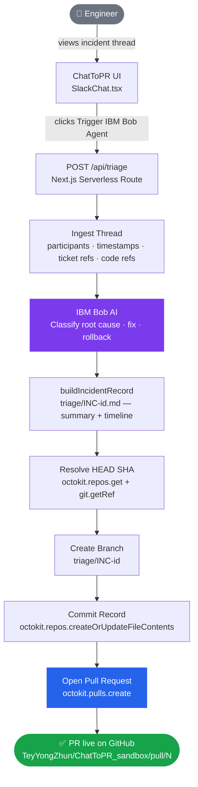

<div align="center">

# ChatToPR

### Turn a Slack incident thread into a GitHub Pull Request — automatically.

*Built for the IBM Bob Hackathon · Powered by IBM Bob AI*

[](https://nextjs.org/)
[](https://www.typescriptlang.org/)
[](https://tailwindcss.com/)
[](https://vercel.com/)
[-181717?style=flat-square&logo=github&logoColor=white)](https://github.com/octokit/rest.js)

**[🚀 Live Demo](https://chat-to-pr-two.vercel.app)** &nbsp;·&nbsp; **[📦 Sandbox Repo](https://github.com/TeyYongZhun/ChatToPR_sandbox)** &nbsp;·&nbsp; **[🐛 Report an Issue](https://github.com/TeyYongZhun/ChatToPR/issues)**

</div>

---

## Overview

ChatToPR is an AI-powered developer tool that eliminates the manual overhead between **incident diagnosis** and **code review**. When a production incident is triage in Slack, engineers have already done the hard cognitive work — they've identified the root cause, agreed on a fix, and decided on a rollback. ChatToPR captures that context and turns it into a structured GitHub Pull Request in seconds, without anyone leaving the conversation.

> **Developers spend only 16% of their workweek writing code.** The rest is consumed by context-switching and operational overhead. *([Atlassian State of DevEx](https://medium.com/@wextechblogs/let-developers-code-what-atlassians-state-of-devex-can-tell-us-about-using-ai-effectively-d0c5f0b10301))*

---

## Live Demo

> **[chat-to-pr.vercel.app](https://chat-to-pr-two.vercel.app)** — no login or setup required.

Click **Trigger IBM Bob Agent** on the demo page. Within seconds, a real `triage/INC-<id>` branch is created and a Pull Request is opened on the public sandbox repository — open [`TeyYongZhun/ChatToPR_sandbox`](https://github.com/TeyYongZhun/ChatToPR_sandbox/pulls) in a new tab to see it live.

---

## The Problem

Production incidents follow a predictable pattern:

1. An engineer spots an anomaly and posts in `#incidents-production`.
2. The team collaborates — they confirm the issue, trace the root cause, agree on a fix.
3. Then someone has to **leave the conversation**, open GitHub, create a branch, write or document the fix, and open a PR.

That transition — from chat to code — is pure overhead. It's error-prone, slow, and happens dozens of times per sprint.

---

## How It Works

ChatToPR automates steps 3 onward. Given a Slack thread, it:

| # | Action | Output |
|---|---|---|
| 1 | **Ingests the thread** | Structured message array with author, timestamp, text |
| 2 | **Extracts signals** | Ticket refs (`#4821`), code symbols (`` `OrderRepository.findAll()` ``), participants |
| 3 | **Classifies key messages** | Identifies root cause, fix, and rollback messages via IBM Bob AI |
| 4 | **Builds an incident record** | A `triage/INC-<id>.md` file with summary table, highlighted signals, and full timeline |
| 5 | **Opens a GitHub PR** | Creates branch `triage/INC-<id>`, commits the record, raises a Pull Request |

---

## System Workflow



---

## Key Features

| Feature | Description |
|---|---|
| **One-click triage** | Single button triggers the full pipeline — no CLI, no manual GitHub steps |
| **Structured incident records** | Auto-generates `triage/INC-<id>.md` with summary, root cause, fix, rollback, and full message timeline |
| **Smart signal extraction** | Parses ticket refs, inline code symbols, and participant names from free-form chat text |
| **IBM Bob AI classification** | Language-aware root cause and fix detection — works regardless of how engineers phrase things |
| **Full GitHub automation** | Branch creation, file commit, and PR opening via `@octokit/rest` — fully programmatic |
| **Human review gate** | Every record is a PR, never auto-merged; engineers retain final authority over `main` |
| **Secure by default** | PAT scoped to `repo` only, stored in `.env.local`, never committed; all actions are append-only |

---

## Built with IBM Bob

IBM Bob is the AI agent engine at the core of ChatToPR. It's what transforms a raw Slack thread — written in the informal shorthand of engineers under pressure — into structured, actionable incident data.

| Bob's role | What it does |
|---|---|
| **Thread comprehension** | Understands the incident narrative holistically across 6+ messages |
| **Root cause extraction** | Identifies the message that explains the underlying failure |
| **Fix identification** | Pinpoints the proposed solution and the target file or function |
| **Rollback detection** | Flags the rollback action if mentioned in the thread |
| **Incident record authoring** | Generates the full `INC-*.md` document — summary table, quoted signals, timeline |

Without Bob, this pipeline would require rigid regex rules that break the moment engineers deviate from a fixed format. Bob makes extraction **language-aware and format-agnostic**.

---

## Tech Stack

| Layer | Technology |
|---|---|
| **Frontend** | Next.js 15 (App Router), React 18, Tailwind CSS |
| **Backend** | Next.js Serverless API Routes, TypeScript 5 |
| **GitHub Integration** | `@octokit/rest` v22 |
| **AI Agent Engine** | IBM Bob |
| **Deployment** | Vercel |

---

## Local Setup

**Prerequisites:** Node.js 18+, a GitHub PAT with `repo` scope ([create one](https://github.com/settings/tokens/new)).

```bash
# 1. Clone
git clone https://github.com/TeyYongZhun/ChatToPR.git
cd ChatToPR

# 2. Install
npm install

# 3. Configure
cp .env.example .env.local
```

Edit `.env.local`:

```env
GITHUB_PAT=ghp_your_token_here
GITHUB_OWNER=TeyYongZhun
GITHUB_REPO=ChatToPR_sandbox
```

```bash
# 4. Run
npm run dev
```

Open [http://localhost:3000](http://localhost:3000), click **Trigger IBM Bob Agent**, and a real GitHub PR will be created in your configured repository.

---

## API Reference

### `POST /api/triage`

Accepts a Slack thread and returns a live GitHub PR URL.

```json
// Request
{
  "thread": [
    { "user": "Sarah Chen", "text": "503s on /v2/orders. Ticket #4821.", "ts": "10:14 AM" },
    { "user": "Marcos Oliveira", "text": "Root cause: toArray() loading full result sets.", "ts": "10:21 AM" }
  ]
}

// Response
{ "ok": true, "prUrl": "https://github.com/TeyYongZhun/ChatToPR_sandbox/pull/42" }
```

**The committed `triage/INC-<id>.md` contains:**

- **Summary table** — incident ID, created timestamp, participants, ticket/PR refs, code refs
- **Root cause** — the identifying message, quoted verbatim
- **Fix** — the proposed solution message
- **Rollback** — the rollback action, if mentioned
- **Full timeline** — every message in chronological order

---

## Project Structure

```
src/
├── app/
│   ├── page.tsx                    # Main UI — renders the SlackChat demo
│   ├── globals.css                 # Tailwind base styles
│   └── api/
│       └── triage/
│           └── route.ts            # POST /api/triage — incident record builder + Octokit automation
└── components/
    └── SlackChat.tsx               # Slack-replica thread UI + IBM Bob agent step runner
```

---

## Roadmap

### ✅ Phase 1 — MVP (shipped)
- [x] Slack-replica chat UI with realistic production incident thread
- [x] `POST /api/triage` serverless route
- [x] IBM Bob classifies root cause, fix, and rollback from free-form chat
- [x] Auto-generates structured `triage/INC-<id>.md` incident record
- [x] GitHub automation — branch creation, file commit, PR open via Octokit
- [x] Human review gate — every record lands as a PR, never auto-merged

### 🔨 Phase 2 — Real Slack Integration
- [ ] OAuth Slack app — read threads from real channels, not a mock UI
- [ ] `/chattopr` slash command to trigger the agent directly from Slack
- [ ] Post the PR link back to the Slack thread once the PR is created

### 🤖 Phase 3 — Code Patch Generation
- [ ] IBM Bob analyses the identified file/function and generates a code diff
- [ ] Patch committed alongside the incident record in the same PR
- [ ] Regression test written by Bob targeting the specific failure mode

### 🔍 Phase 4 — Intelligence & Observability
- [ ] Duplicate detection — flag if a similar incident record already exists
- [ ] Severity scoring — Bob estimates blast radius from thread context
- [ ] Post-mortem template auto-filled from closed incident PRs
- [ ] Dashboard of all `triage/INC-*` PRs with status, MTTR, and recurrence rate

### 🔐 Phase 5 — Enterprise Readiness
- [ ] Multi-repo support — route incidents to the correct repository automatically
- [ ] RBAC — only on-call engineers can trigger the agent
- [ ] Full audit log of every agent action
- [ ] Self-hosted deployment with no data leaving the corporate network

---

## Vision

The gap between *"we know the fix"* and *"the fix is in review"* costs engineering teams hours every week. ChatToPR collapses that gap to seconds. Every action is auditable, reversible, and gated by human approval — the agent accelerates execution while engineers stay in control.

---


<div align="center">
  <sub>Built for the IBM Bob Hackathon</sub>
</div>
