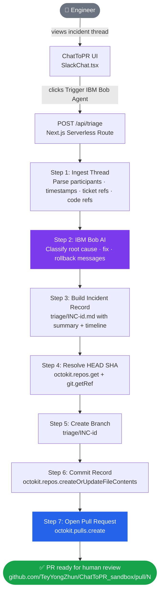

# ChatToPR

> **Turn a Slack incident thread into a GitHub Pull Request — automatically.**


-181717?style=flat-square&logo=github&logoColor=white)

---

## 🔗 Live Demo

**[chat-to-pr.vercel.app](https://chat-to-pr.vercel.app)**

Open the app, click **Trigger IBM Bob Agent**, and watch a real GitHub Pull Request get created in seconds — no setup required.

> The demo targets the public sandbox repo [`TeyYongZhun/ChatToPR_sandbox`](https://github.com/TeyYongZhun/ChatToPR_sandbox). Each run creates a new `triage/INC-<id>` branch and PR you can inspect live.

---

## The Problem

When a production incident hits, engineers already know the fix — in the Slack thread. But translating that conversation into an actual Pull Request means switching tools, creating a branch, writing the fix, and opening a PR. That's 10+ minutes of busywork while the incident clock is running.

> Developers spend only **16% of their workweek writing code**. The rest is swallowed by context-switching and tooling overhead. *([Atlassian State of DevEx](https://medium.com/@wextechblogs/let-developers-code-what-atlassians-state-of-devex-can-tell-us-about-using-ai-effectively-d0c5f0b10301))*

---

## What It Does

ChatToPR reads a Slack incident thread and does the rest automatically:

1. **Ingests the thread** — captures participants, timestamps, ticket references, and inline code symbols.
2. **Builds a structured incident record** — auto-generates a `triage/INC-<id>.md` file with a summary table, identified root cause, fix, rollback action, and full message timeline.
3. **Opens a GitHub PR** — creates a `triage/INC-<id>` branch, commits the incident record, and raises a Pull Request for human review.

One button click. Real PR. No context switching.

---

## System Workflow



| Step | What happens | Where in code |
|---|---|---|
| 1 | Thread POSTed as a JSON array with user, text, ts | `src/components/SlackChat.tsx` |
| 2 | IBM Bob classifies root cause, fix, and rollback messages | IBM Bob Agent Engine |
| 3 | `buildIncidentRecord()` assembles a structured Markdown document | `src/app/api/triage/route.ts` |
| 4 | Default branch HEAD SHA resolved | `src/app/api/triage/route.ts` |
| 5 | Branch `triage/INC-<id>` created | `src/app/api/triage/route.ts` |
| 6 | `triage/INC-<id>.md` committed as base64 blob | `src/app/api/triage/route.ts` |
| 7 | Pull Request opened against default branch | `src/app/api/triage/route.ts` |

---

## Key Features

- **One-click triage** — click "Trigger IBM Bob Agent" and watch the 5-step pipeline run live.
- **Structured incident records** — auto-generates a `triage/INC-<id>.md` with summary table, root cause, fix, rollback, and full message timeline.
- **Smart signal extraction** — automatically parses ticket refs (`#4821`), code refs (`` `OrderRepository.findAll()` ``), and participants from free-form chat.
- **Full GitHub automation** — branch creation, file commit, and PR opening via `@octokit/rest`.
- **Human review always required** — every record lands as a PR, never auto-merged to `main`.
- **Secure by default** — PAT stored in `.env.local`, never committed; all agent actions are append-only.

---

## Tech Stack

| Layer | Technology |
|---|---|
| Frontend | Next.js 15 (App Router), React 18, Tailwind CSS |
| Backend | Next.js Serverless API Routes, TypeScript 5 |
| GitHub | `@octokit/rest` |
| AI Agent | IBM Bob |

---

## Local Setup

**Prerequisites:** Node.js 18+, a GitHub PAT with `repo` scope.

```bash
# 1. Clone
git clone https://github.com/TeyYongZhun/ChatToPR.git
cd ChatToPR

# 2. Install
npm install

# 3. Configure
cp .env.example .env.local
```

Edit `.env.local`:

```env
GITHUB_PAT=ghp_your_token_here
GITHUB_OWNER=TeyYongZhun
GITHUB_REPO=ChatToPR_sandbox
```

```bash
# 4. Run
npm run dev
```

Open [http://localhost:3000](http://localhost:3000), click **Trigger IBM Bob Agent**, and a real GitHub PR will be created.

---

## How the API Works

`POST /api/triage` accepts a thread and returns a PR URL.

```json
// Request
{ "thread": [{ "user": "Sarah Chen", "text": "503s on /v2/orders. Ticket #4821.", "ts": "10:14 AM" }] }

// Response
{ "ok": true, "prUrl": "https://github.com/TeyYongZhun/ChatToPR_sandbox/pull/42" }
```

The committed file (`triage/INC-<id>.md`) contains:

- **Summary table** — incident ID, timestamp, participants, ticket/PR refs, code refs
- **Root cause** — the message matching root cause keywords, quoted verbatim
- **Fix** — the message describing the fix
- **Rollback** — the rollback action if mentioned
- **Full timeline** — every message in chronological order

---

## Project Structure

```
src/
├── app/
│   ├── page.tsx                   # Main UI
│   └── api/triage/route.ts        # Incident record builder + GitHub automation
└── components/
    └── SlackChat.tsx               # Slack-replica thread UI + agent step runner
```

---

## Vision

ChatToPR was built for the IBM Bob Hackathon. The goal: eliminate the busywork between *"we know the fix"* and *"the fix is in review"*. Every action is auditable, reversible, and gated by human approval — the agent accelerates execution, engineers stay in control.

---

## License

MIT
