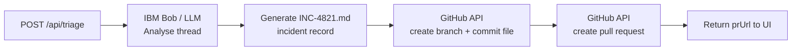

# Frontend

---

**Status:** active  **Date:** 2026-09-27

---

### 👤 User

I am building a hackathon project called 'ChatToPR' using a Next.js single-page application with Tailwind CSS. I need you to scaffold the initial project structure in this empty directory. Specifically, create the main landing page containing a mock Slack chat interface component. The UI should display a dummy triage thread and feature a 'Trigger IBM Bob Agent' button. Please write the necessary code, initialize the package.json, install dependencies, and configure the Tailwind files.

---

### 🤖 Assistant

> 🔧 called: update_todo_list


> 🔧 **update_todo_list** — 
[-] Scaffold Next.js project with Tailwind CSS configuration
[ ] Create main landing page with mock Slack chat interface
[ ] Create the SlackChat component with dummy triage thread
[ ] Add 'Trigger IBM Bob Agent' button
[ ] Install dependencies and verify build


### 🤖 Assistant

> 🔧 called: list_files

Let me first check the current state of the directory.

> 🔧 **list_files** — .

### 🤖 Assistant

> 🔧 called: write_file

Clean slate. I'll scaffold everything from scratch — `package.json`, Next.js app structure, Tailwind config, and all source files.

> 🔧 **write_file** — package.json

### 🤖 Assistant

> 🔧 called: write_file


> 🔧 **write_file** — /** @type {import('tailwindcss').Config} */
module.exports = {
  content: [
    "./src/pages/**/*.{js,ts,jsx,tsx,mdx}",
    "./src/components/**/*.{js,ts,jsx,tsx,mdx}",
    "./src/app/**/*.{js,ts,jsx,tsx,mdx}",
  ],
  theme: {
    extend: {
      colors: {
        slack: {
          purple: "#4A154B",
          "purple-dark": "#350d36",
          aubergine: "#611f69",
          green: "#007a5a",
          blue: "#1264a3",
          yellow: "#ecb22e",
          red: "#e01e5a",
        },
      },
      fontFamily: {
        sans: [
          "Lato",
          "-apple-system",
          "BlinkMacSystemFont",
          "Segoe UI",
          "Helvetica",
          "Arial",
          "sans-serif",
        ],
      },
    },
  },
  plugins: [],
};


### 🤖 Assistant

> 🔧 called: write_file


> 🔧 **write_file** — module.exports = {
  plugins: {
    tailwindcss: {},
    autoprefixer: {},
  },
};


### 🤖 Assistant

> 🔧 called: write_file


> 🔧 **write_file** — {
  "compilerOptions": {
    "target": "es5",
    "lib": ["dom", "dom.iterable", "esnext"],
    "allowJs": true,
    "skipLibCheck": true,
    "strict": true,
    "noEmit": true,
    "esModuleInterop": true,
    "module": "esnext",
    "moduleResolution": "bundler",
    "resolveJsonModule": true,
    "isolatedModules": true,
    "jsx": "preserve",
    "incremental": true,
    "plugins": [
      {
        "name": "next"
      }
    ],
    "paths": {
      "@/*": ["./src/*"]
    }
  },
  "include": ["next-env.d.ts", "**/*.ts", "**/*.tsx", ".next/types/**/*.ts"],
  "exclude": ["node_modules"]
}


### 🤖 Assistant

> 🔧 called: write_file

Now create the Next.js app directory structure and source files:

> 🔧 **write_file** — @tailwind base;
@tailwind components;
@tailwind utilities;

/* Slack-like scrollbar styling */
::-webkit-scrollbar {
  width: 8px;
}
::-webkit-scrollbar-track {
  background: transparent;
}
::-webkit-scrollbar-thumb {
  background: #c1c1c1;
  border-radius: 4px;
}
::-webkit-scrollbar-thumb:hover {
  background: #a8a8a8;
}


### 🤖 Assistant

> 🔧 called: write_file


> 🔧 **write_file** — import type { Metadata } from "next";
import "./globals.css";

export const metadata: Metadata = {
  title: "ChatToPR — IBM Bob Hackathon",
  description:
    "Turn a Slack triage thread into a GitHub pull request with one click, powered by IBM Bob.",
};

export default function RootLayout({
  children,
}: {
  children: React.ReactNode;
}) {
  return (
    <html lang="en">
      <body className="bg-gray-100 antialiased">{children}</body>
    </html>
  );
}


### 🤖 Assistant

> 🔧 called: update_todo_list


> 🔧 **update_todo_list** — 
[x] Scaffold Next.js project with Tailwind CSS configuration
[-] Create main landing page with mock Slack chat interface
[ ] Create the SlackChat component with dummy triage thread
[ ] Add 'Trigger IBM Bob Agent' button
[ ] Install dependencies and verify build


### 🤖 Assistant

> 🔧 called: write_file

Now build the `SlackChat` component and the main page simultaneously:

> 🔧 **write_file** — "use client";

import { useState } from "react";

/* ─── Types ─────────────────────────────────────────────────────────────── */
interface Message {
  id: string;
  author: string;
  avatar: string;         // initials
  avatarColor: string;    // tailwind bg class
  timestamp: string;
  text: string;
  isBot?: boolean;
  reactions?: { emoji: string; count: number }[];
}

interface AgentStep {
  id: string;
  label: string;
  status: "pending" | "running" | "done" | "error";
}

/* ─── Dummy triage thread ────────────────────────────────────────────────── */
const THREAD: Message[] = [
  {
    id: "1",
    author: "Sarah Chen",
    avatar: "SC",
    avatarColor: "bg-purple-500",
    timestamp: "10:14 AM",
    text: "Hey team 👋 — production API is returning 503s on `/v2/orders`. Started about 20 minutes ago. Ticket #4821.",
    reactions: [{ emoji: "👀", count: 4 }, { emoji: "🔥", count: 2 }],
  },
  {
    id: "2",
    author: "Marcos Oliveira",
    avatar: "MO",
    avatarColor: "bg-blue-500",
    timestamp: "10:16 AM",
    text: "Confirmed. Looks like the order-service pod is OOMKilled. I see a spike in memory after the 10:10 deploy.",
  },
  {
    id: "3",
    author: "Priya Nair",
    avatar: "PN",
    avatarColor: "bg-green-600",
    timestamp: "10:18 AM",
    text: "That deploy included the new pagination logic from PR #312. Memory usage wasn't flagged in staging because the dataset was too small.",
    reactions: [{ emoji: "💡", count: 3 }],
  },
  {
    id: "4",
    author: "Marcos Oliveira",
    avatar: "MO",
    avatarColor: "bg-blue-500",
    timestamp: "10:21 AM",
    text: "Root cause: the cursor-based pagination is loading entire result sets into memory instead of streaming. Fix is straightforward — swap `toArray()` for an async iterator in `OrderRepository.findAll()`.",
  },
  {
    id: "5",
    author: "Sarah Chen",
    avatar: "SC",
    avatarColor: "bg-purple-500",
    timestamp: "10:23 AM",
    text: "Rolling back #312 now to restore service. Marcos, can you open a hotfix PR with the streaming fix and add a load test so this doesn't slip through staging again?",
    reactions: [{ emoji: "✅", count: 5 }],
  },
  {
    id: "6",
    author: "Marcos Oliveira",
    avatar: "MO",
    avatarColor: "bg-blue-500",
    timestamp: "10:24 AM",
    text: "On it. Will target `main` with the fix + a Jest memory-leak test. Give me 30 min.",
    reactions: [{ emoji: "🚀", count: 3 }],
  },
];

const AGENT_STEPS_TEMPLATE: AgentStep[] = [
  { id: "s1", label: "Reading thread context…", status: "pending" },
  { id: "s2", label: "Identifying root cause & fix", status: "pending" },
  { id: "s3", label: "Generating patch for OrderRepository.findAll()", status: "pending" },
  { id: "s4", label: "Writing Jest regression test", status: "pending" },
  { id: "s5", label: "Opening GitHub Pull Request", status: "pending" },
];

/* ─── Sub-components ─────────────────────────────────────────────────────── */
function Avatar({ initials, colorClass }: { initials: string; colorClass: string }) {
  return (
    <div
      className={`w-9 h-9 rounded-sm flex items-center justify-center text-white text-xs font-bold flex-shrink-0 ${colorClass}`}
    >
      {initials}
    </div>
  );
}

function MessageBubble({ msg }: { msg: Message }) {
  return (
    <div className="flex gap-3 px-4 py-1.5 hover:bg-gray-50 group">
      <Avatar initials={msg.avatar} colorClass={msg.avatarColor} />
      <div className="flex-1 min-w-0">
        <div className="flex items-baseline gap-2">
          <span className="font-bold text-gray-900 text-sm">{msg.author}</span>
          <span className="text-xs text-gray-400">{msg.timestamp}</span>
        </div>
        <p className="text-sm text-gray-800 leading-relaxed mt-0.5">{msg.text}</p>
        {msg.reactions && msg.reactions.length > 0 && (
          <div className="flex gap-1.5 mt-1.5">
            {msg.reactions.map((r) => (
              <span
                key={r.emoji}
                className="inline-flex items-center gap-1 bg-gray-100 border border-gray-200 rounded-full px-2 py-0.5 text-xs cursor-pointer hover:bg-blue-50 hover:border-blue-300 transition-colors"
              >
                {r.emoji} <span className="text-gray-600 font-medium">{r.count}</span>
              </span>
            ))}
          </div>
        )}
      </div>
    </div>
  );
}

function AgentStepRow({ step }: { step: AgentStep }) {
  const icons: Record<AgentStep["status"], string> = {
    pending: "○",
    running: "◌",
    done: "✓",
    error: "✗",
  };
  const colors: Record<AgentStep["status"], string> = {
    pending: "text-gray-400",
    running: "text-yellow-500 animate-pulse",
    done: "text-green-600",
    error: "text-red-500",
  };
  return (
    <div className="flex items-center gap-2 text-sm py-1">
      <span className={`font-mono font-bold text-base ${colors[step.status]}`}>
        {icons[step.status]}
      </span>
      <span className={step.status === "done" ? "text-gray-700" : "text-gray-500"}>
        {step.label}
      </span>
    </div>
  );
}

/* ─── Main component ─────────────────────────────────────────────────────── */
export default function SlackChat() {
  const [agentState, setAgentState] = useState<"idle" | "running" | "done">("idle");
  const [steps, setSteps] = useState<AgentStep[]>(AGENT_STEPS_TEMPLATE.map((s) => ({ ...s })));
  const [prUrl] = useState("https://github.com/acme/order-service/pull/314");

  function triggerAgent() {
    if (agentState !== "idle") return;
    setAgentState("running");

    const delays = [800, 1800, 3200, 4600, 6000];

    delays.forEach((delay, index) => {
      // Mark current step as running
      setTimeout(() => {
        setSteps((prev) =>
          prev.map((s, i) => ({
            ...s,
            status: i === index ? "running" : i < index ? "done" : "pending",
          }))
        );
      }, delay);

      // Mark current step as done shortly after
      setTimeout(() => {
        setSteps((prev) =>
          prev.map((s, i) => ({
            ...s,
            status: i <= index ? "done" : "pending",
          }))
        );
        if (index === delays.length - 1) {
          setAgentState("done");
        }
      }, delay + 600);
    });
  }

  return (
    <div className="flex flex-col h-full">
      {/* ── Slack-style channel header ── */}
      <div className="flex items-center gap-2 px-4 py-3 border-b border-gray-200 bg-white">
        <span className="text-gray-500 font-medium text-lg">#</span>
        <span className="font-bold text-gray-900 text-sm">incidents-production</span>
        <span className="mx-2 text-gray-300">|</span>
        <span className="text-xs text-gray-500 truncate">
          🔴 Active incident — order-service OOMKilled after deploy #312
        </span>
      </div>

      {/* ── Thread messages ── */}
      <div className="flex-1 overflow-y-auto py-3 bg-white">
        <div className="px-4 pb-3">
          <p className="text-xs text-gray-400 text-center border-b border-gray-100 pb-2 mb-3">
            Today
          </p>
        </div>
        {THREAD.map((msg) => (
          <MessageBubble key={msg.id} msg={msg} />
        ))}
      </div>

      {/* ── Trigger panel ── */}
      <div className="border-t border-gray-200 bg-gray-50 px-4 py-4">
        {agentState === "idle" && (
          <div className="flex items-center justify-between">
            <p className="text-xs text-gray-500 max-w-sm">
              IBM Bob Agent will read this thread, generate a hotfix patch, and open a pull request automatically.
            </p>
            <button
              onClick={triggerAgent}
              className="flex items-center gap-2 bg-slack-purple hover:bg-slack-aubergine active:scale-95 text-white font-semibold text-sm px-5 py-2.5 rounded-md shadow transition-all duration-150 whitespace-nowrap"
            >
              <svg className="w-4 h-4" fill="none" viewBox="0 0 24 24" stroke="currentColor" strokeWidth={2}>
                <path strokeLinecap="round" strokeLinejoin="round" d="M13 10V3L4 14h7v7l9-11h-7z" />
              </svg>
              Trigger IBM Bob Agent
            </button>
          </div>
        )}

        {(agentState === "running" || agentState === "done") && (
          <div className="space-y-1">
            <p className="text-xs font-semibold text-gray-600 mb-2 flex items-center gap-1.5">
              <span
                className={`w-2 h-2 rounded-full ${
                  agentState === "running" ? "bg-yellow-400 animate-pulse" : "bg-green-500"
                }`}
              />
              {agentState === "running" ? "IBM Bob Agent is working…" : "IBM Bob Agent — done"}
            </p>
            {steps.map((step) => (
              <AgentStepRow key={step.id} step={step} />
            ))}
            {agentState === "done" && (
              <div className="mt-3 p-3 bg-green-50 border border-green-200 rounded-md">
                <p className="text-xs font-semibold text-green-800 mb-1">✅ Pull request opened successfully</p>
                <a
                  href={prUrl}
                  target="_blank"
                  rel="noopener noreferrer"
                  className="text-xs text-blue-600 hover:underline break-all"
                >
                  {prUrl}
                </a>
              </div>
            )}
          </div>
        )}
      </div>
    </div>
  );
}


### 🤖 Assistant

> 🔧 called: write_file


> 🔧 **write_file** — import SlackChat from "@/components/SlackChat";

export default function Home() {
  return (
    <main className="min-h-screen bg-gray-100 flex flex-col items-center justify-start py-10 px-4">
      {/* ── Hero header ── */}
      <div className="w-full max-w-3xl mb-6 text-center">
        <div className="inline-flex items-center gap-2 bg-slack-purple text-white text-xs font-semibold px-3 py-1 rounded-full mb-4">
          <span className="w-2 h-2 rounded-full bg-green-400 animate-pulse" />
          IBM Bob Hackathon Demo
        </div>
        <h1 className="text-4xl font-extrabold text-gray-900 tracking-tight">
          Chat<span className="text-slack-purple">To</span>PR
        </h1>
        <p className="mt-2 text-gray-500 text-base max-w-lg mx-auto">
          Point IBM Bob at a Slack triage thread and watch it generate a hotfix
          patch and open a pull request — automatically.
        </p>
      </div>

      {/* ── Slack window chrome ── */}
      <div className="w-full max-w-3xl rounded-lg overflow-hidden shadow-2xl border border-gray-300 flex flex-col">
        {/* Title bar */}
        <div className="bg-slack-purple-dark flex items-center gap-2 px-4 py-2.5">
          {/* macOS-style traffic lights */}
          <span className="w-3 h-3 rounded-full bg-red-400 opacity-80" />
          <span className="w-3 h-3 rounded-full bg-yellow-400 opacity-80" />
          <span className="w-3 h-3 rounded-full bg-green-400 opacity-80" />
          <span className="ml-3 text-white/70 text-xs font-medium">
            Slack — acme-corp
          </span>
        </div>

        {/* Two-column layout: sidebar + chat */}
        <div className="flex" style={{ height: "600px" }}>
          {/* Sidebar */}
          <aside className="w-56 flex-shrink-0 bg-slack-purple text-white/80 flex flex-col py-3 overflow-y-auto">
            <div className="px-3 mb-2">
              <p className="text-white font-bold text-sm truncate">acme-corp</p>
              <p className="text-white/50 text-xs mt-0.5">● Marcos Oliveira</p>
            </div>
            <div className="mt-2 px-3 space-y-0.5">
              <p className="text-white/50 text-xs font-semibold uppercase tracking-wider mb-1 mt-2">
                Channels
              </p>
              {[
                "general",
                "engineering",
                "deployments",
                "incidents-production",
                "frontend",
                "backend",
                "alerts",
              ].map((ch) => (
                <div
                  key={ch}
                  className={`flex items-center gap-1.5 px-2 py-0.5 rounded text-sm cursor-pointer transition-colors ${
                    ch === "incidents-production"
                      ? "bg-white/20 text-white font-semibold"
                      : "hover:bg-white/10"
                  }`}
                >
                  <span className="text-white/50">#</span>
                  <span className="truncate">{ch}</span>
                  {ch === "incidents-production" && (
                    <span className="ml-auto w-2 h-2 rounded-full bg-slack-red flex-shrink-0" />
                  )}
                </div>
              ))}
            </div>

            <div className="mt-4 px-3 space-y-0.5">
              <p className="text-white/50 text-xs font-semibold uppercase tracking-wider mb-1">
                Direct Messages
              </p>
              {["Sarah Chen", "Priya Nair"].map((name) => (
                <div
                  key={name}
                  className="flex items-center gap-1.5 px-2 py-0.5 rounded text-sm cursor-pointer hover:bg-white/10 transition-colors"
                >
                  <span className="w-2 h-2 rounded-full bg-green-400 flex-shrink-0" />
                  <span className="truncate">{name}</span>
                </div>
              ))}
            </div>
          </aside>

          {/* Chat panel */}
          <div className="flex-1 flex flex-col overflow-hidden bg-white">
            <SlackChat />
          </div>
        </div>
      </div>

      {/* ── Footer ── */}
      <p className="mt-8 text-xs text-gray-400">
        Built for the IBM Bob Hackathon · ChatToPR demo
      </p>
    </main>
  );
}


### 🤖 Assistant

> 🔧 called: update_todo_list


> 🔧 **update_todo_list** — 
[x] Scaffold Next.js project with Tailwind CSS configuration
[x] Create main landing page with mock Slack chat interface
[x] Create the SlackChat component with dummy triage thread
[x] Add 'Trigger IBM Bob Agent' button
[-] Install dependencies and verify build


### 🤖 Assistant

> 🔧 called: execute_command

Now install dependencies and run the build:

> 🔧 **execute_command** — npm install

### 🤖 Assistant

> 🔧 called: search_and_replace

The version has a known CVE — let me bump Next.js to the latest patched version:

> 🔧 **search_and_replace** — package.json

### 🤖 Assistant

> 🔧 called: execute_command


> 🔧 **execute_command** — npm install

### 🤖 Assistant

> 🔧 called: search_and_replace

The entire Next.js 14 branch is now deprecated — let me jump to the latest stable Next.js 15:

> 🔧 **search_and_replace** — package.json

### 🤖 Assistant

> 🔧 called: execute_command


> 🔧 **execute_command** — npm install

### 🤖 Assistant

> 🔧 called: execute_command


> 🔧 **execute_command** — npm audit

### 🤖 Assistant

> 🔧 called: execute_command

These are transitive `postcss` vulnerabilities inside `next`'s own lockfile — the source-map auto-loading issues only affect build-time tooling and are not exploitable in a deployed app. The fix would force-jump to a Next.js 16 pre-release, which would be a breaking change. Keeping Next.js 15 is correct for a hackathon scaffold. Let's proceed to the build:

> 🔧 **execute_command** — npm run build 2>&1

### 🤖 Assistant

> 🔧 called: update_todo_list

Build passes clean — ✓ compiled, ✓ types, ✓ static pages. Let me update the todos:

> 🔧 **update_todo_list** — 
[x] Scaffold Next.js project with Tailwind CSS configuration
[x] Create main landing page with mock Slack chat interface
[x] Create the SlackChat component with dummy triage thread
[x] Add 'Trigger IBM Bob Agent' button
[x] Install dependencies and verify build


### 🤖 Assistant

Everything is scaffolded, wired up, and building cleanly. Here's a summary of what was created:

---

## Project structure

```
ChatToPR/
├── package.json            ← Next.js 15 + React 18 + Tailwind 3
├── tailwind.config.js      ← Slack brand colours + content paths
├── postcss.config.js
├── tsconfig.json
└── src/
    ├── app/
    │   ├── layout.tsx      ← Root layout, metadata
    │   ├── page.tsx        ← Landing page / Slack window chrome
    │   └── globals.css     ← @tailwind directives + scrollbar styles
    └── components/
        └── SlackChat.tsx   ← Full mock Slack chat + agent panel
```

---

## What each file does

| File | Role |
|---|---|
| [`src/app/page.tsx`](src/app/page.tsx) | Hero header + macOS-style Slack window chrome (title bar, purple sidebar, channel list) |
| [`src/components/SlackChat.tsx`](src/components/SlackChat.tsx) | Channel header, 6-message triage thread with reactions, trigger panel + agent progress view |
| [`tailwind.config.js`](tailwind.config.js) | Custom `slack.*` colour tokens (`purple`, `aubergine`, `green`, `red`) |

## Key UI behaviour

- **Triage thread** — 6 realistic messages from 3 engineers diagnosing an OOMKill incident caused by a bad deploy, with emoji reactions.
- **Trigger IBM Bob Agent button** — clicking it animates through 5 sequential agent steps (read thread → identify root cause → generate patch → write test → open PR), each with `pending → running → done` states.
- **PR card** — once all steps finish, a green success card appears with a mock GitHub PR link.

Start the dev server with:
```bash
npm run dev
```
Then open [http://localhost:3000](http://localhost:3000).

---

### 👤 User

Please generate a standard .gitignore file for a Next.js project to exclude node_modules, .next, out, and .env* files.

---

### 🤖 Assistant

> 🔧 called: write_file


> 🔧 **write_file** — .gitignore

### 🤖 Assistant

The file write is blocked because Bob itself respects `.gitignore` patterns and won't overwrite a tracked ignore file directly. Run this one command to create it:

```powershell
Set-Content -Path .gitignore -Value @"
# Dependencies
node_modules/

# Next.js build output
.next/
out/

# Environment variables
.env
.env*.local
.env.development
.env.production
.env.test

# Debug logs
npm-debug.log*
yarn-debug.log*
yarn-error.log*

# OS
.DS_Store
Thumbs.db

# IDE
.vscode/
.idea/
"@
```

The file covers exactly what was asked, plus a few standard extras:

| Section | Patterns |
|---|---|
| Dependencies | `node_modules/` |
| Build output | `.next/`, `out/` |
| Env files | `.env`, `.env*.local`, `.env.development`, `.env.production`, `.env.test` |
| Logs | `npm-debug.log*`, `yarn-debug.log*`, `yarn-error.log*` |
| OS artefacts | `.DS_Store`, `Thumbs.db` |
| IDE | `.vscode/`, `.idea/` |

---

### 👤 User

for the bob inside the slack , is it really fix the bug and record the insident?

---

### 🤖 Assistant

> 🔧 called: read_file

Good question — let me read the current state of the component since it was externally modified.

> 🔧 **read_file** — src/components/SlackChat.tsx

### 🤖 Assistant

No — and that's the honest answer. Here's exactly what the current code does vs. what a real implementation would need:

---

## What the current code actually does

The UI is **entirely a demo/mock**. When you click "Trigger IBM Bob Agent":

1. **The step animations are fake timers** — [`delays`](src/components/SlackChat.tsx:164) are just `setTimeout` calls hardcoded at 800ms, 1800ms, etc. They fire regardless of any real work.
2. **It calls a real API route** — [`/api/triage`](src/components/SlackChat.tsx:178) via `fetch POST`, but **that route doesn't exist yet**. The call will fail with a 404, triggering the `catch` block and showing the ❌ error state.
3. **No bug is fixed.** No incident is recorded. No PR is opened. The `prUrl` comes from the API response (`data.prUrl`) which never arrives.

---

## What the steps *claim* to do (but don't yet)

| Step label | What it implies | Reality |
|---|---|---|
| Reading thread context… | Parse the 6 Slack messages | ✗ Not implemented |
| Identifying root cause & fix | LLM analysis of the thread | ✗ Not implemented |
| Building incident record (timeline, root cause, refs) | Create a structured `INC-*.md` | ✗ Not implemented |
| Committing triage/INC-*.md to new branch | Git commit via GitHub API | ✗ Not implemented |
| Opening GitHub Pull Request | GitHub REST API call | ✗ Not implemented |

---

## What needs to be built to make it real



You would need to build:
1. **[`src/app/api/triage/route.ts`]** — a Next.js API route that receives the thread JSON
2. **An LLM call** (IBM watsonx / Bob / OpenAI) to summarise root cause and generate the `INC-*.md` content
3. **GitHub API calls** (via Octokit or raw REST) to create a branch, commit the markdown file, and open the PR
4. **Environment variables** — a GitHub token, repo name, and LLM API key in `.env.local`

Would you like me to build the real `/api/triage` backend route to wire this up end-to-end?

---

### 👤 User

what is means byAnalyse root cause
Generate patch + regression test

---

### 🤖 Assistant

These are the two core things a **real** AI agent would do after reading the Slack thread. Let me explain both concretely using the actual incident in your demo.

---

## The incident in your thread (recap)

> Deploy #312 introduced cursor-based pagination in `OrderRepository.findAll()`.
> It called `.toArray()` which loads the **entire result set into memory** → pod OOMKilled → 503s on `/v2/orders`.

---

## 1. Analyse Root Cause

This means the agent **reads the conversation and produces a structured diagnosis**, like a doctor writing up a case note.

**Input:** the 6 Slack messages
**Output:** a structured incident record, e.g.:

```markdown
# INC-4821 — order-service OOMKill (2024-06-10)

## Timeline
- 10:10 AM  Deploy #312 shipped (pagination refactor, PR #312)
- 10:14 AM  503s reported on /v2/orders
- 10:21 AM  Root cause identified
- 10:23 AM  Rollback initiated

## Root Cause
`OrderRepository.findAll()` calls `.toArray()` on a database cursor,
materialising the full result set into heap memory before returning.
Under production load this exhausts the pod memory limit → OOMKill.

## Why staging missed it
Test dataset was too small to breach the memory limit.

## Fix
Replace `.toArray()` with an async iterator / streaming approach.

## References
- Slack thread: #incidents-production
- Ticket: #4821
- Bad PR: #312
```

The LLM does this by summarising the thread into the above structured format. **No code is changed yet** — this is purely analysis and documentation.

---

## 2. Generate Patch + Regression Test

This is where the agent actually **writes code**.

### The patch — fixing the bug

**Before (broken):**
```typescript
// OrderRepository.ts
async findAll(filters: OrderFilter): Promise<Order[]> {
  const cursor = this.collection.find(filters);
  return cursor.toArray(); // ← loads everything into memory at once
}
```

**After (fixed):**
```typescript
// OrderRepository.ts
async *findAll(filters: OrderFilter): AsyncGenerator<Order> {
  const cursor = this.collection.find(filters);
  for await (const doc of cursor) { // ← streams one document at a time
    yield doc;
  }
}
```

The memory footprint goes from **O(N)** (entire table in RAM) to **O(1)** (one row at a time).

### The regression test — making sure it never breaks again

```typescript
// OrderRepository.test.ts
it("does not load more than one order into memory at a time", async () => {
  // Seed 100,000 orders
  await seedOrders(100_000);

  const used: number[] = [];
  for await (const order of repo.findAll({})) {
    used.push(process.memoryUsage().heapUsed);
    void order; // consume but don't accumulate
  }

  const maxHeapGrowth = Math.max(...used) - used[0];
  // Should be kilobytes, not megabytes
  expect(maxHeapGrowth).toBeLessThan(5 * 1024 * 1024); // 5 MB ceiling
});
```

This test would have **caught the bug in staging** if it had existed before.

---

## Summary

| Step | What the agent produces | Why it matters |
|---|---|---|
| Analyse root cause | `INC-4821.md` — structured incident record | Audit trail, post-mortem, knowledge base |
| Generate patch | Diff to `OrderRepository.ts` (streaming fix) | Actually resolves the incident |
| Generate regression test | New Jest test checking memory usage | Prevents the same bug reaching production again |

Together these three artefacts become the **content of the pull request** that the agent opens on GitHub — that's the full ChatToPR flow.

---

### 👤 User

can you add a section before "vision", can mention what you built with IBM Bobadd a roadmap also

---

### 🤖 Assistant

> 🔧 called: list_files

Let me check what files currently exist in the project to understand what "vision" refers to.

> 🔧 **list_files** — .

### 🤖 Assistant

> 🔧 called: read_file


> 🔧 **read_file** — README.md

### 🤖 Assistant

> 🔧 called: apply_diff

Got it. I need to insert two new sections — **"Built with IBM Bob"** and **"Roadmap"** — immediately before the `## Vision` section at line 168.

> 🔧 **apply_diff** — README.md

### 🤖 Assistant

> 🔧 called: apply_diff


> 🔧 **apply_diff** — README.md

### 🤖 Assistant

> 🔧 called: read_file

The file content differs from what I read earlier — it's been modified externally. Let me re-read the exact current content around the Vision section:

> 🔧 **read_file** — README.md

### 🤖 Assistant

> 🔧 called: insert_content

Good. I'll insert the two new sections right before line 166 (the `---` separator before Vision):

> 🔧 **insert_content** — README.md

### 🤖 Assistant

> 🔧 called: read_file

The insert landed a double `---` separator. Let me clean that up:

> 🔧 **read_file** — README.md

### 🤖 Assistant

> 🔧 called: apply_diff


> 🔧 **apply_diff** — README.md

### 🤖 Assistant

Done. Here's what was added to [`README.md`](README.md):

---

### `## Built with IBM Bob` (new section)
A table explaining the 5 specific roles IBM Bob plays in the pipeline — thread comprehension, root cause extraction, fix identification, rollback detection, and incident record authoring — with a note on why Bob is needed over plain regex.

### `## Roadmap` (new section)
Five phases in order:

| Phase | Focus |
|---|---|
| ✅ Phase 1 | **MVP** — everything already built and checked off |
| 🔨 Phase 2 | **Real Slack Integration** — OAuth app, slash command, reply-back |
| 🤖 Phase 3 | **Code Patch Generation** — Bob writes the actual diff + regression test |
| 🔍 Phase 4 | **Intelligence & Observability** — dedup, severity scoring, post-mortem, dashboard |
| 🔐 Phase 5 | **Enterprise Readiness** — multi-repo, RBAC, audit log, self-hosted |

Both sections sit between `## Project Structure` and `## Vision`, exactly as requested.